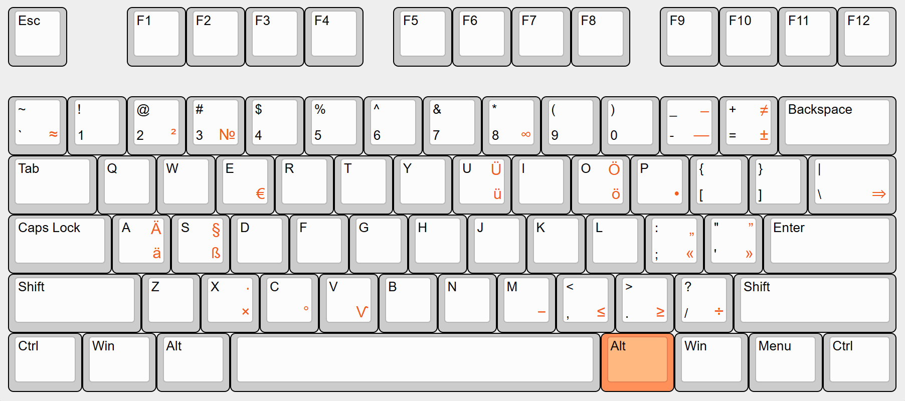

# DEnglisch Keyboard Layout

**Denglisch** (Deutsch + English) is a custom keyboard layout that keeps the familiar **English (US)** key positions while enabling **comfortable German typing**. It also adds a curated set of **typographical** and **mathematical** symbols so you can write clear, beautiful text without digging through character maps.

The layout is intended for writers, developers, and anyone who prefers the US layout (for shortcuts and punctuation) but needs to type German seamlessly.

---

## How It Works

* DEnglisch preserves the **US base layer** so common symbols and hotkeys remain where you expect them.
* **German characters and extra symbols** are accessed via modifier layers — **Right Alt (AltGr)** and **Shift+AltGr** combinations — following intuitive placements.
* Once installed, the layout is available **system‑wide** and can be toggled like any other Windows keyboard.

> Exact key combinations depend on the final keymap. Add a reference image or table in the repository for quick learning.

---

## Installation (Windows 10, 11)

> If you’ve previously installed an older version, uninstall it first (see [Uninstall](#uninstall)).

1. **Get the installer**
   Download the latest release archive from this repository and extract it.
2. **Run the installer**
   Execute `setup.exe` from the extracted folder. Approve any prompts (you may be asked for administrator permission).
3. **Restart Windows**
   Reboot to ensure the layout is fully registered by the system.
4. **Remove the default US layout**

---

## Uninstall

1. **Disable the layout first**
   Switch to a different keyboard (e.g., US) and go to **Settings → Time & Language → Language → (English) → Options → Keyboards**. Remove **DEnglisch** from the list.
2. **Uninstall the package**
   Open **Settings → Apps → Apps & features** (or **Control Panel → Programs and Features**) and uninstall **DEnglisch Keyboard Layout**.
3. **Restart Windows**
   A reboot ensures the keyboard service releases the layout.

> If Windows reports the layout is in use, sign out and sign back in (or reboot) and try again.

---
## FAQ

**Does this change my coding shortcuts?**
No. The base layer remains US, so common editor/IDE shortcuts stay familiar. Extra characters live on AltGr/Shift‑AltGr layers.

**Will this work on Windows 11?**
It may, but it’s only **tested on Windows 10** so far. Contributions that document Windows 11 behavior are welcome.

**Does the installer need admin rights?**
Typically yes, because keyboard layouts integrate with the system input service.

**Is any data collected?**
No. This is a standard keyboard layout package with no background services created using Microsoft Keyboard Layout Creator 1.4 (MSKLC).
